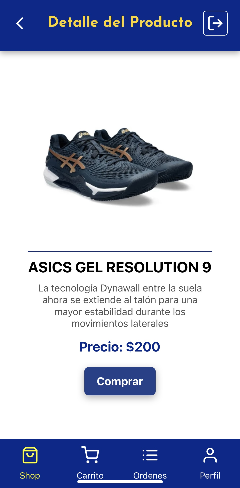
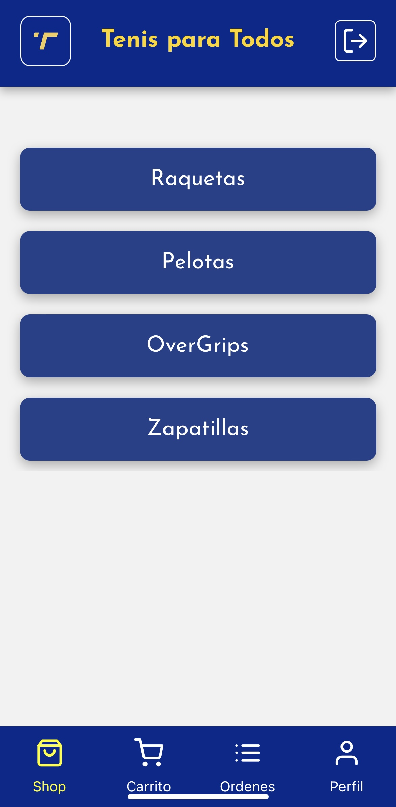
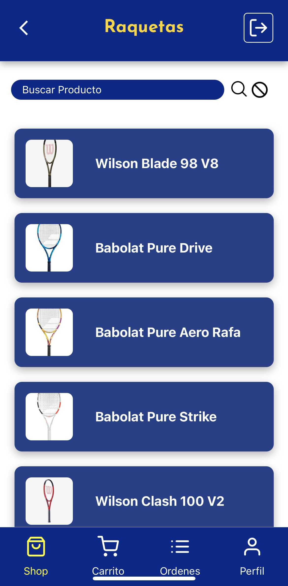
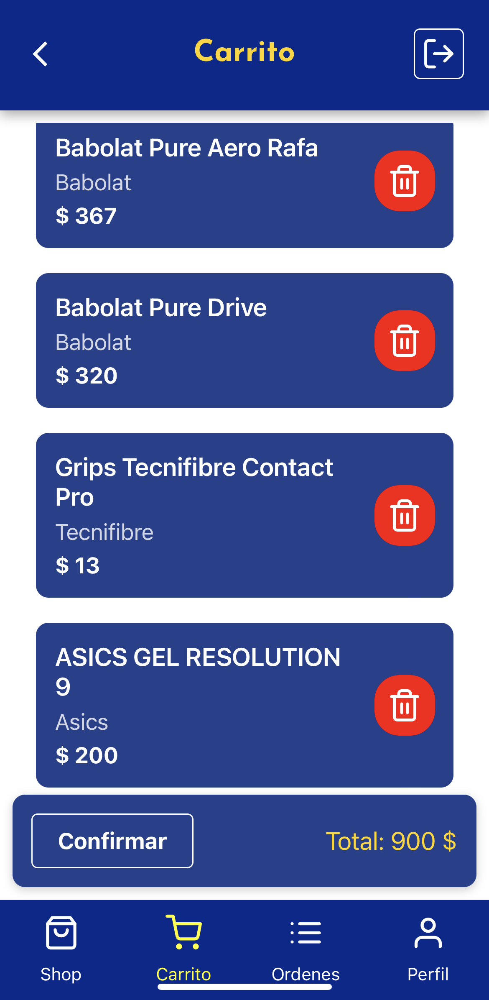
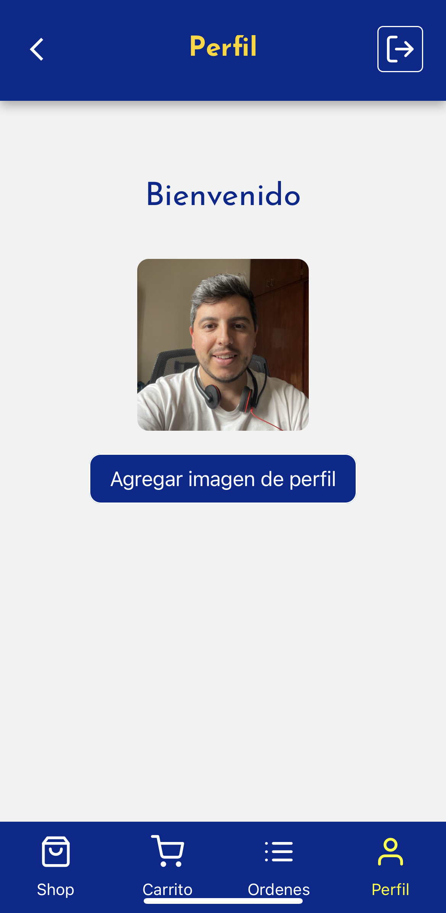

# E-Commerce App - React Native - Tenis para Todos

Esta aplicación de comercio electrónico, desarrollada con React Native, ofrece una experiencia de compra intuitiva y fluida. Diseñada específicamente para la venta de tenis, combina un atractivo visual con funcionalidades clave que facilitan la navegación y la compra.

## Caracteristicas

- **Interfaz Amigable:** Una experiencia de usuario optimizada que permite a los clientes explorar y comprar fácilmente.


- **Catálogo de Productos:** Muestra una variedad de tenis con detalles, imágenes y precios.



-**Carrito de Compras:** Permite a los usuarios añadir productos, revisar su selección y proceder al pago.



-**Gestión de Acceso de Usuarios:** 
- Implementa el robusto sistema de autenticación de Firebase para asegurar un control efectivo del acceso.
- Ofrece a los usuarios la posibilidad de registrarse e iniciar sesión de forma segura, garantizando la protección de su información personal.

               


### Pantalla de Cuenta

- **Acceso seguro:** Solo los usuarios autenticados pueden acceder a la pantalla de perfil y realizar compras.
- **Información del usuario:** Muestra detalles foto de perfil del Usuario .



## Tecnologías Empleadas

- **Firebase Authentication:** Se implementa este sistema para garantizar la seguridad y gestión del acceso de los usuarios en la aplicación.
- **React Native Navigation Stack:** Utiliza esta herramienta para organizar la navegación entre diversas pantallas.
- **React Native Navigation Bottom Tab:** Facilita la navegación a través de pestañas en la interfaz.
- **Expo Location:** Proporciona funcionalidades para acceder y administrar la ubicación del usuario.
- **Expo Image Picker:** Permite a los usuarios cargar imágenes de perfil de manera sencilla.
- **Redux:** Centraliza el manejo del estado de la aplicación, mejorando la gestión de datos.
- **RTK Query y Firebase:** Utiliza estas herramientas para realizar operaciones de lectura y escritura en la base de datos.


## Instalación

1. Clona el repositorio: 
   ```bash
   git clone https://github.com/tu-usuario/tu-aplicacion.git

2. Instala las dependencias usando Yarn: `yarn install`

   > **Nota:** Este proyecto utiliza Yarn como gestor de paquetes. Asegúrate de tenerlo instalado en tu sistema.

3. Configura las claves de API para servicios externos (Expo-Location, Firebase, etc.).
4. Configura las credenciales de Firebase en tu proyecto.
5. Ejecuta la aplicación: `yarn start`


## Contacto

Para preguntas o soporte, contacta a sape_27@hotmail.com.
